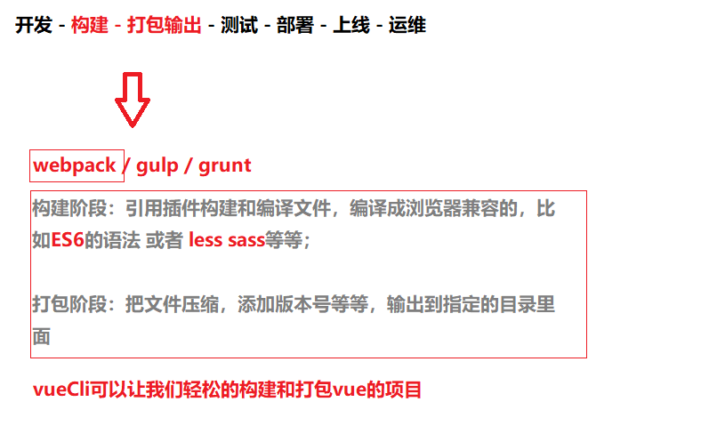
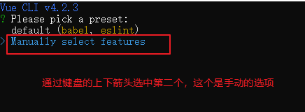
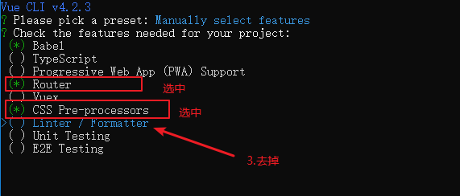
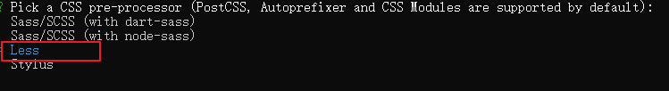
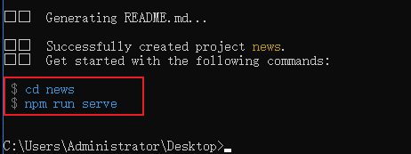
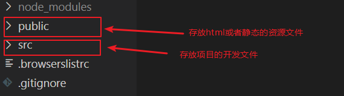

# 项目准备


## 关于Vue Cli

1. 什么是Vue Cli
2. 安装命令
3. 创建项目 （选择手动）


### 什么是Vue Cli

[官网地址](https://cli.vuejs.org/zh/)




### 安装命令

```
npm install @vue/cli
```

> v. 4.2.3 注意版本会变化的


### 创建项目 

1.执行下载的命令

```
vue create news
```

> news是项目的名称

2.选中手动安装



3.手动的选项

> 按空格键选中和取消



4.连续两个回车之后选择css的预编译（less）




5.后面全部回车等待依赖包的安装。

6.安装成功

> 看到下面两个命令就成功了



7.运行项目

```
// 切换到项目的文件夹
cd news

// 运行下面的npm命令
npm run serve
```


## 项目结构介绍

1.文件夹目录




2.项目开发的入口文件

`src/main.js`

```js
// vue构造函数
import Vue from 'vue'
// App组件（以.vue结尾的文件都是组件）
import App from './App.vue'
// 路由对象
import router from './router'

// 上线环境是否提示信息(忽略)
Vue.config.productionTip = false

// 创建一个根实例
// .$mount('#app') 相当于el配置，指定id为app的元素作为模板
new Vue({
  // 路由对象
  router,
  // 加载第一个子组件，最底层的组件，（写法是固定的）
  render: h => h(App)
}).$mount('#app')
```


## 把项目上传到github


## 项目后台


# 项目开始


# 登录页

1. 登录页面布局

2. 表单组件封装

3. 表单验证

4. 提交表单


# vant-ui组件库

[官网地址](https://youzan.github.io/vant/#/zh-CN/intro)

1. 下载命令
2. 配置
3. 测试使用


## 下载命令

```
npm install vant
```


## 配置

**全局引入所有组件**

> 注意：还有[其他的引入方式](https://youzan.github.io/vant/#/zh-CN/quickstart#yin-ru-zu-jian)，各有优点。
>
> 全局引入好处是只引入一次，就可以在任何页面中使用。
>
> 缺点是用不到的组件也会打包进来。

`src/main.js`

```js
import Vue from 'vue';
import Vant from 'vant';

Vue.use(Vant);

// 其他代码...
```

**导入样式**

`src/App.vue`

```vue
<style>
@import url('../node_modules/vant/lib/index.css');

/* 其他代码... */
</style>
```


## 测试使用

测试弹窗，[toast组件](https://youzan.github.io/vant/#/zh-CN/toast)

```vue
<template>
	<button @click="$toast('弹窗测试')">测试弹窗</button>    
</template>
<script>
    export default {

    }
</script>
```


# Axios异步请求库

[官网地址](https://github.com/axios/axios)

1. 下载命令
2. 配置
3. 测试使用


## 下载命令

```
npm install axios
```


## 配置

`src/main.js`

```js
import axios from "axios";

// 绑定到原型
Vue.prototype.$axios = axios;

axios.defaults.baseURL = "http://localhost:3000"

// 其他代码...
```


## 测试使用

```js
// get请求
// method默认是get
// params是get请求的参数
this.$axios({
    url: "/post",
    method: 'GET', 
    params: {
        id: 1
    }
}).then(res => {
    console.log(res)
})

// post请求
// method是POST
// data是post请求的参数
this.$axios({
    url: "/login",
    method: 'POST',
    data: this.form
}).then(res => {
    console.log(res)
})
```


# 注册页

1. 注册页面布局

2. 表单绑定数据

3. 表单验证

4. 提交表单

