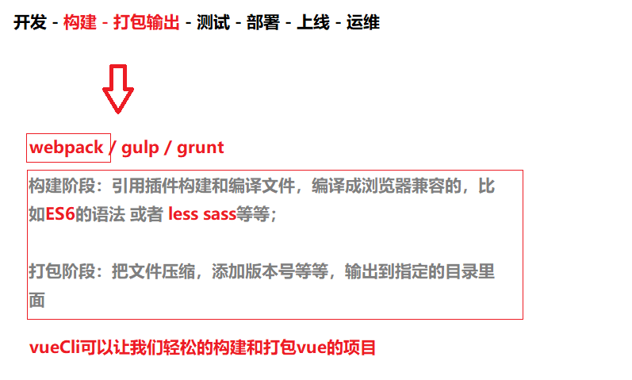
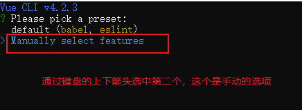
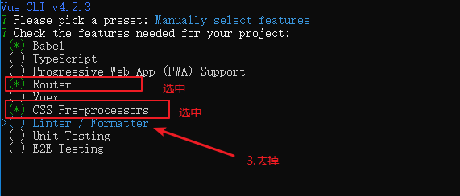
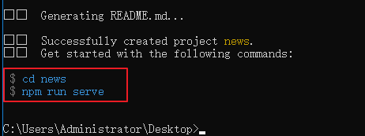
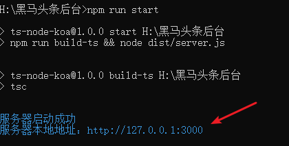
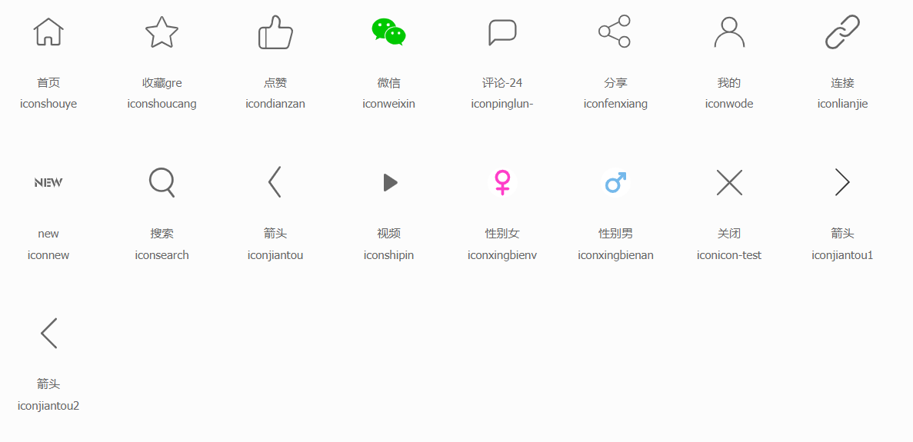

# 项目准备

43期黑马头条项目项目地址：<https://github.com/itcast-hsian/news-43>


## 关于Vue Cli

1. 什么是Vue Cli
2. 安装命令
3. 创建项目 （选择手动）


### 什么是Vue Cli

[官网地址](https://cli.vuejs.org/zh/)




### 安装命令

```
npm install @vue/cli
```

> v. 4.2.3 注意版本会变化的


### 创建项目 

1.执行下载的命令

```
vue create news
```

> news是项目的名称

2.选中手动安装



3.手动的选项

> 按空格键选中和取消



4.连续两个回车之后选择css的预编译（less）


5.后面全部回车等待依赖包的安装。

6.安装成功

> 看到下面两个命令就成功了



7.运行项目

```
// 切换到项目的文件夹
cd news

// 运行下面的npm命令
npm run serve
```


## 项目结构介绍

1.文件夹目录


2.项目开发的入口文件

`src/main.js`

```js
// vue构造函数
import Vue from 'vue'
// App组件（以.vue结尾的文件都是组件）
import App from './App.vue'
// 路由对象
import router from './router'

// 上线环境是否提示信息(忽略)
Vue.config.productionTip = false

// 创建一个根实例
// .$mount('#app') 相当于el配置，指定id为app的元素作为模板
new Vue({
  // 路由对象
  router,
  // 加载第一个子组件，最底层的组件，（写法是固定的）
  render: h => h(App)
}).$mount('#app')
```


## 把项目上传到github

1.创建github项目


2.关联本地的项目到远程的仓库


3.在项目的命令行下执行上面最长的这段话


4.可以上传

```
git add -A // 也可以用点
git commit -m "描述"
git push origin master
```


## 项目后台

先做完登录页之后再来安装项目的后台

项目地址：<https://github.com/itcast-hsian/Typescript-Node-Koa2>

> 运行的过程中没有报错就是成功,报错指的是 error，红色的东西

1.下载安装

```
git clone https://github.com/itcast-hsian/Typescript-Node-Koa2.git
```

2.安装依赖

```shell
cd Typescript-Node-Koa2   # 可以自己改名字
npm install
```

3.启动项目

```
npm run start
```

如果看到下面的界面就是启动成功




# 项目开始


## 删除不必要的文件

1. 把`src/views`下面的文件全部删掉
2. 把`src/components`下面的文件全部删掉
3. `src/router/index.js`删除路由配置和导入的文件
4. 清理下`App.vue`下多余的html结构和样式


## 样式初始化

公共样式

`src/App.vue`

```css
<style lang="less">
// 公共的样式
*{
    margin: 0;
    padding: 0;
}

a {
    color: inherit;
    text-decoration: none;
}

a:hover{
    color: inherit;
}

ul, li, ol{
    list-style: none;
}

i, em{
    font-style: normal;
}
</style>
```


# 登录页

1. 创建登录页
2. 引入图标库
3. 登录页面布局

2. 表单组件封装

3. 表单验证

4. 提交表单


## 创建登录页

1.在`src/views`文件夹新建一个`Login.vue`组件

```vue
<template>
    <div>登录页</div>
</template>
<script>
export default {
    
};
</script>
<style>
</style>
```

2.新建时候通过“shift+左侧的尖括号”，在提示栏选择第一个再确定，就会出来已vue组件模板

3.配置路由

`src/router/index.js`

```js
// 路由配置
const routes = [
	{
		path: "/login",
		// 除了首页之外的页面都可以用懒加载,@符号代表的src这个目录
		// .vue这个扩展名可以忽略
		component: () => import("@/views/Login")
	}
]
```


**4.在浏览器中打开<http://localhost:8080/login>就可以看到登录组件的内容了**


## 引入图标库

1.项目`src/App.vue`引入图标库

```css
<style lang="less">
// css 原生的写法
@import url("//at.alicdn.com/t/font_1426139_jm7n2373nlh.css");
```

2.在页面中测试图标库的引入

> 注意：需要用到哪个图标就看我发给大家的图



`src/views/login.vue`

```vue
<template>
    <div>
        登录页
        <!-- 要显示阿里图标库的图标，必须要加上iconfont这个类名，第二类名就是你想要显示的那个图标 -->
        <span class="iconfont iconnew"></span>
        <span class="iconfont iconweixin"></span>
    </div>
</template>
```

如果图标能够出来就表示图标引入就没问题 !


----------------------------------------------------------- day06 结束分割线 ---------------------------------------------------------------------

-----------------------------------------------------------------------------------------------------------------------------------------------------------

----------------------------------------------------------- day07 开发 ---------------------------------------------------------------------------


## 登录页面布局

> 这里自己写下登录页


## 表单提交

1.通过axios提交登录的表单

2.表单提交成功之后要提示用户

3.返回信息400的错误先暂时忽略，后面通过axios统一处理


# vant-ui组件库

[官网地址](https://youzan.github.io/vant/#/zh-CN/intro)

1. 下载命令
2. 配置
3. 测试使用


## 下载命令

```
npm install vant
```


## 配置

**全局引入所有组件**

> 注意：还有[其他的引入方式](https://youzan.github.io/vant/#/zh-CN/quickstart#yin-ru-zu-jian)，各有优点。
>
> 全局引入好处是只引入一次，就可以在任何页面中使用。
>
> 缺点是用不到的组件也会打包进来。

`src/main.js`

```js
import Vue from 'vue';
import Vant from 'vant';

Vue.use(Vant);

// 其他代码...
```

**导入样式**

`src/App.vue`

```vue
<style>
@import url('../node_modules/vant/lib/index.css');

/* 其他代码... */
</style>
```


## 测试使用

测试弹窗，[toast组件](https://youzan.github.io/vant/#/zh-CN/toast)

```vue
<template>
	<button @click="$toast('弹窗测试')">测试弹窗</button>    
</template>
<script>
    export default {

    }
</script>
```


# Axios异步请求库

[官网地址](https://github.com/axios/axios)

1. 下载命令
2. 配置
3. 测试使用


## 下载命令

```
npm install axios
```


## 配置

`src/main.js`

```js
import axios from "axios";

// 绑定到原型
Vue.prototype.$axios = axios;

axios.defaults.baseURL = "http://localhost:3000"

// 其他代码...
```


## 测试使用

```js
// get请求
// method默认是get
// params是get请求的参数
this.$axios({
    url: "/post",
    method: 'GET', 
    params: {
        id: 1
    }
}).then(res => {
    console.log(res)
})

// post请求
// method是POST
// data是post请求的参数
this.$axios({
    url: "/login",
    method: 'POST',
    data: this.form
}).then(res => {
    console.log(res)
})
```


# 注册页

1. 注册页面布局

2. 表单绑定数据

3. 表单验证

4. 提交表单

