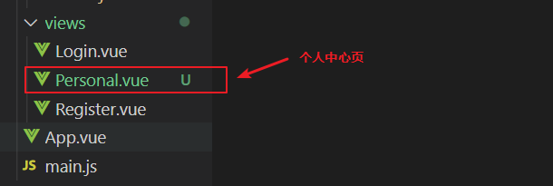
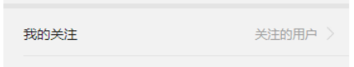
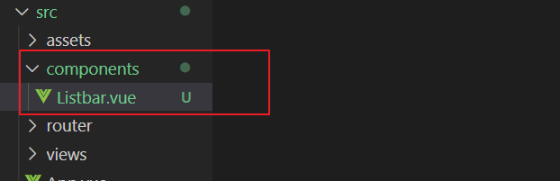
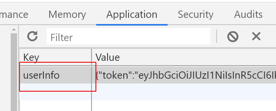

# 个人中心页

1. 创建一个个人中心页（路径是： /personal）
2. 页面静态布局
3. 列表按钮栏组件封装


## 创建一个个人中心页

1.在`src/views`中创建一个`personal.vue`



创建完毕随便给template先加个内容

```
<template>
  <div>个人中心</div>
</template>
```

2.配置路由

在路由的配置中添加多一项

```
{
    // 个人中心页
    path: "/personal",
    component: () => import("@/views/Personal")
}
```

3.手动在浏览器打开地址<http://localhost:8080/personal>预览


## 页面静态布局

参考提交代码


## 列表按钮栏组件封装




**1.在`src/components`新建一个文件`Listbar.vue`**



**2.添加组件的内容**

包含布局和样，样式参考提交的代码

```vue
<template>
    <!-- 列表按钮栏 -->
    <div class="listbar">
        <router-link to="#">
            <div>我的关注</div>
            <div class="tips">
                关注的用户
                <span class="iconfont iconjiantou1"></span>
            </div>
        </router-link>
    </div>
</template>
```

**3.把组件导入到`src/views/personal.vue`**

**一定要注意：要在script标签里面导入，并且一定是写在export default {}的上面**

```vue
<script>
    // 导入列表按钮栏的组件，import后面接上的组件变量名（变量就意味着可以随便改名字）
    // @代表src目录
    import Listbar from "@/components/Listbar"

    export default {
        // 注册组件,导入的子组件都必须注册才可以再模板渲染
        components: {
            Listbar
        }
    };
</script>
```

然后就可以在模板中调用了,模板`template`

```
<!-- 组件的调用，单双标签都可以 -->
<Listbar/>
```


**4.给`src/components/Listbar.vue`组件添加props**

```vue
<script>
export default {
    // 声明组件可以接收的属性, label表示左边的文字, tips是右边的文字
    props: ["label", "tips"],
};
</script>
```


**5.通过自定义的data数据循环出多个Listbar**

`src/views/personal`

```js
export default {
	data(){
		return {
			// 组织一个列表按钮栏的数据
			rows: [
				{ label: "我的关注", tips: "关注的用户" },
				{ label: "我的跟帖", tips: "跟帖回复" },
				{ label: "我的收藏", tips: "文章视频" },
				{ label: "设置", tips: "" },
			]
		}
	},
    // ....
};
```


然后可以在模板中循环渲染上面的数据

```vue
<!-- 组件的调用，单双标签都可以 -->
<!-- :key不是报错，可以不加，
但是vue希望给循环的元素指定“唯一的key”，所以推荐我们在循环时候都加上 -->
<Listbar v-for="(item, index) in rows" :key="index"
         :label="item.label" 
         :tips="item.tips"/>
```


## 请求个人的详情

请求个人的信息肯定都是需要授权登录的，必须给接口提供token，保证当前是一个登录的状态，接口还需要提供你的用id


**1.获取用户id和token，在登录成功后把用户的数据保存到本地**

`src/views/login`

```js
.then(res => {
    // 获取到返回的信息, data是token和用户的信息，data是保存到本地的
    const {message, data} = res.data;
    // 使用vant的弹窗提示用，success表示成功的弹窗
    this.$toast.success(message);

    // 把token和id保存到本地
    // localStorage只能保存字符串，需要使用JSON.stringify来把对象转换成字符串
    localStorage.setItem("userInfo", JSON.stringify(data));

    // 先暂时登录成功跳转个人中心页
    this.$router.push("/personal");
})
```

查看浏览器是否保存成功




**2.回到个人中心页请求个人的详情数据**

根据本地的token和id请求个人的详情数据

`src/views/personal.vue`

```js
// 组件加载完毕后触发，类似window.onload
mounted(){
    // 从本地获取token和id
    const jsonStr = localStorage.getItem("userInfo");
    // 把字符串转成对象,userJson就是用户的信息对象
    // userJson.token和userJson.user.id 这两个值是接口需要的
    const userJson = JSON.parse(jsonStr);

    // 发起异步的请求
    this.$axios({
        url: "/user/" +   userJson.user.id,
        // 添加头信息
        headers: {
            Authorization: userJson.token
        }
    }).then(res => {
        console.log(res)
    })
}
```


## 渲染页面的数据

下午


