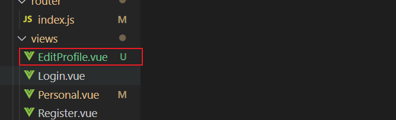
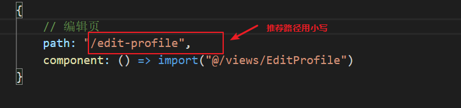
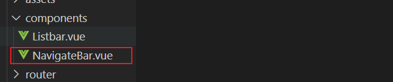
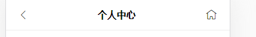
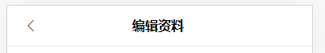

# 编辑资料页


## 创建一个编辑资料页

1.创建文件



2.配置路由




## 封装了头部导航组件



组价是用在个人中心系列页面的顶部





需要区别除了个人中心页有首页的图标之外，其他页面不需要，所以要提取两个动态的属性

* title：标题的文字
* showHome: 是否展示首页图标

`src/components/navigateBar.vue`

```
props: [
    'title',
    'showHome'
]
```

title直接接受展示即可，showHome如果传递的值是true的话就展示可以点击跳转到首页的span图标，如果不传或者传递的值是false，展示一个透明度为0的图标，**为了防止flex布局变形，所以需要透明度为0的元素占个位置**


## 页面静态布局


## 上传头像

上传头像是要点击头像图片就可以选择图片来上传，就可以在头像图片的上面覆盖一个上传的按钮，按钮使用vant-ui的上传按钮

文档地址：<https://youzan.github.io/vant/#/zh-CN/uploader>  #使用基础用法

> 注意把按钮透明度设置为0

### 修改布局


`src/views/EditProfile.vue`

```vue
<!-- 头像 -->
<div class="avatar">
    

    <!-- 添加上传的组件 -->
    <van-uploader class="uploader" :after-read="afterRead" />
</div>
```


### 开始上传

上传图片的代码是写在`afterRead`事件内的

> 1.afterRead的参数file.file才是要上传的文件对象
>
> 2.headers的userJson要记得绑定到data
>
> 3.需要使用FormData来创建表单类型的数据，axios会自动判断当前的数据类型（json还是表单）
>
> 4.图片上传成功之后不代表头像就修改，要修改头像需要再次调用编辑用户信息的接口`handleEdit`

```js
// 图片上传的方法，file是对文件对象（认为它是不可读的）
afterRead(file){
    // 创建一个表单对象，上传图片资源必须是表单类型,不能用json
    // 大家不用去纠结json还是表单的头信息，axios会自动设置的
    const formData = new FormData();

    // 通过原有的方法append给表单添加元素
    // 第一个字符串的file表示接口接收的属性，第二个 file.file是文件对象
    formData.append('file', file.file)

    // 开始上传
    this.$axios({
        url: "/upload",
        // post请求
        method: "POST",
        // 添加头信息
        headers: {
            // userJson要记得绑定到data
            Authorization: this.userJson.token
        },
        data: formData
    }).then(res => {
        // url就是图片的路径
        const {url} = res.data.data;
        // 替换掉当前的头像路径
        this.userInfo.head_img = url;
        // 图片上传成功之后调用编辑用户信息的方法
        this.handleEdit({
            head_img: url
        })
    })
},
```


### 编辑用户的头像信息

一定要注意，编辑用户的头像信息一定是在图片上传成功之后执行，所以一定是在**.then的函数里面**

> 参数data是由外部传入的

```js
// 编辑用户信息的函数
// data就是请求的参数
handleEdit(data){
    this.$axios({
        url: '/user_update/' + this.userInfo.id,
        method: "POST",
        // 添加头信息
        headers: {
            Authorization: this.userJson.token
        },
        data,
    }).then(res => {
        console.log(res)
    })
}
```


